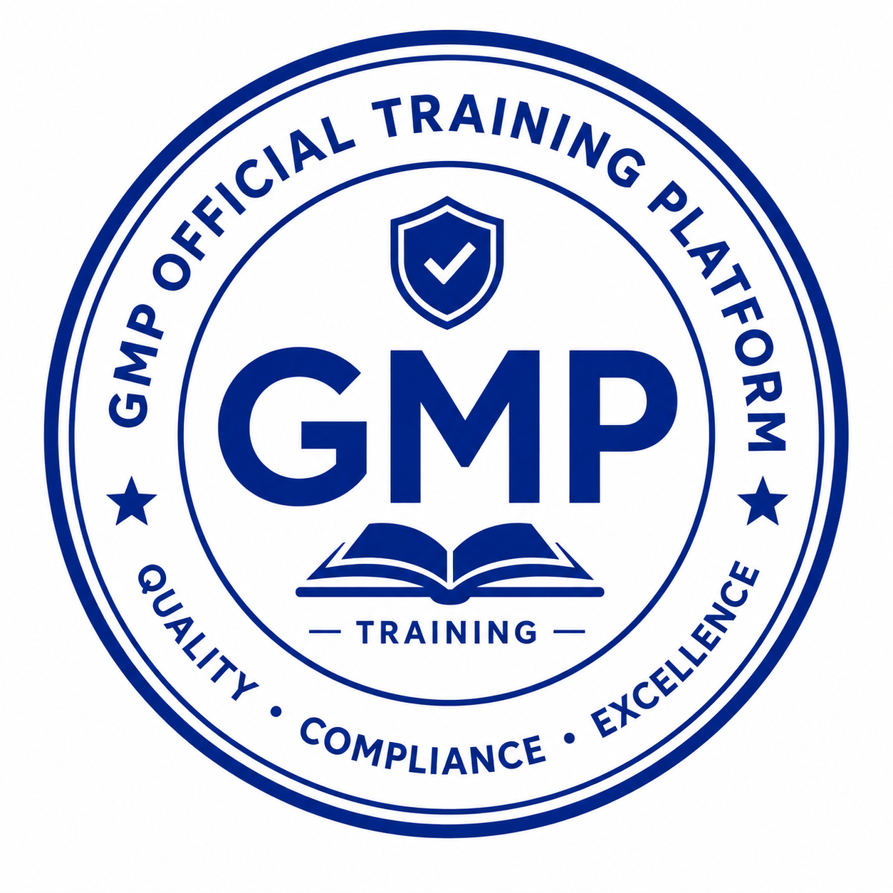

<div align="center">



# GMP Learning Agent

### AI-Powered GMP Education Platform for Pharmaceutical Students

**[中文文档](./README_CN.md)** · **English**

<br/>

[](https://nextjs.org/)
[](https://fastapi.tiangolo.com/)
[](https://langchain-ai.github.io/langgraph/)
[](https://www.typescriptlang.org/)
[](https://www.mysql.com/)
[](LICENSE)

<br/>

> *Real GMP inspection defects → adaptive learning scenarios → gamified mastery.*
> Built for pharmacy & pharmaceutical engineering students in China.

</div>

---

## What is this?

China's **Good Manufacturing Practice (GMP)** regulation is the backbone of pharmaceutical quality management — and one of the hardest subjects to teach effectively.

This platform transforms **real GMP inspection findings** from Zhejiang Province (2022–2025) into interactive learning: knowledge graphs, AI tutoring, simulation exams, course modules with discussion forums, and a gamified progression system — all tailored to the student's major and dosage-form track. Teachers and admins get a dedicated portal to manage courses, assignments, and analytics.

---

## Features

<table>
<tr>
<td width="50%">

**🤖 Agentic RAG Tutor**
LangGraph `retrieve → generate → critique → respond` pipeline. Hybrid MySQL FULLTEXT + vector retrieval. Every answer cites the exact GMP clause. Conversations are **persisted** — pick up where you left off. "Wrong answer" reports feed back directly into the evaluation dataset.

</td>
<td width="50%">

**📚 Full Course Module**
11 chapters mapped to T01–T11 training projects. Each chapter has: KP list with mastery, regulation references, an AI classroom, a chapter quiz, simulation drill, discussion forum, and assignment submissions — all in one place.

</td>
</tr>
<tr>
<td>

**🎯 Defect-Driven Learning**
Real inspection data (top defect clauses, severity distribution) shapes every exercise, case, and quiz — not textbook theory alone. 590 skill points extracted from 13 defect template documents.

</td>
<td>

**🎮 Gamified Progression**
Three-currency system: XP (character level) · Points (rewards) · Credits (academic score). Daily streaks, module unlocks, boss battles, class leaderboard. Spaced-repetition review queue driven by forgetting-curve data.

</td>
</tr>
<tr>
<td>

**🗺️ Knowledge Graph**
469 knowledge points visualized as a force-directed graph (ECharts). Personal mastery overlay with 4-tier color scale — see exactly where you stand across 7,290 KP→regulation edges.

</td>
<td>

**👩‍🏫 Teacher & Admin Portals**
Teachers publish assignments, view class analytics, browse the question bank, and export CSVs. Admins manage users, knowledge-point dependencies, and system config — all without touching the database.

</td>
</tr>
</table>

---

## Architecture

```
┌──────────────────────────────────────────────┐
│               gmp-web  (Frontend)             │
│  Next.js 15 · TypeScript · Tailwind · Radix   │
│  ECharts · Drizzle ORM · MySQL2               │
└──────────────────┬───────────────────────────┘
                   │  REST API + SSE stream
┌──────────────────▼───────────────────────────┐
│               gmp-api  (Backend)              │
│  FastAPI · LangGraph · pymysql                │
│  MySQL FULLTEXT + cosine vector retrieval     │
│  Qwen3-max  (DashScope OpenAI-compat.)        │
└──────────────────────────────────────────────┘
                   │  shared
┌──────────────────▼───────────────────────────┐
│         MySQL 9.x  (single database)          │
│  25 tables · 37,000+ rows · FULLTEXT indexed  │
└──────────────────────────────────────────────┘
```

**Tutor Agent pipeline**

```
question → [retrieve]  MySQL FULLTEXT + cosine vector + KP graph hop
         → [generate]  Qwen3-max
         → [critique]  hallucination / faithfulness check
         → [respond]   answer + GMP clause citations  (SSE stream)
         → [persist]   chat_messages table  →  shown on next load
         → [feedback]  "wrong answer" → feedback_log  →  eval dataset
```

---

## Dataset at a Glance

| Dataset | Count |
|---------|------:|
| Knowledge points (associate + bachelor dual-track) | **469** |
| KP → regulation clause edges | **7,290** |
| GMP 2010 regulation library (articles + annexes) | **1,740** |
| Question bank (MCQ / multi-select / T-F / essay) | **543** |
| Case library (5 dosage-form categories, 18 products) | **117** |
| Skill points (extracted from defect template docs) | **590** |
| Skill → KP links (3-tier confidence) | **24,145** |
| Training projects (simulation scenarios) | **11** |

---

## Role Map

| Role | Entry | Capabilities |
|------|-------|-------------|
| **Student** | `/dashboard` → onboarding pre-test | All learning features + gamification |
| **Teacher** | `/teacher` | Assignments, student analytics, question bank, CSV export |
| **Admin** | `/admin` | User CRUD, KP dependency graph, system config |

---

## Quick Start

> Full setup: [SETUP.md](./SETUP.md)

**Prerequisites:** Node 20+, Python 3.11+, MySQL 8+

```bash
# 1. Clone
git clone https://github.com/Cryptic-LEY/gmp-agent.git
cd gmp-agent

# 2. Database — run the DDL against your MySQL instance
mysql -u root -p gmp < gmp-web/db/migrate-new-tables.sql

# 3. Frontend
cd gmp-web
npm install
cp .env.local.example .env.local   # fill JWT_SECRET + MySQL credentials
npm run dev                         # → http://localhost:3000

# 4. Backend
cd ../gmp-api
pip install -r requirements.txt
cp .env.example .env               # fill DASHSCOPE_API_KEY + MySQL credentials
uvicorn main:app --reload --port 8001
```

> The question bank and knowledge graph data (~37,000 rows) are not in the repo. Contact the maintainer for a MySQL dump.

---

## Project Structure

```
gmp-agent/
├── gmp-web/                        # Next.js 15 frontend + API routes
│   ├── app/
│   │   ├── (main)/
│   │   │   ├── dashboard/          # Hero stats, knowledge graph, streaks
│   │   │   ├── course/             # 11-chapter course module
│   │   │   │   └── [trainingId]/   # Chapter detail: tabs for quiz, sim, discussion, assignments
│   │   │   ├── chat/               # AI tutor (persistent, with feedback)
│   │   │   ├── practice/           # Daily adaptive quiz (5 modes)
│   │   │   ├── simulation/         # RPG-style case exam (map, boss, wallet)
│   │   │   ├── plan/               # Personalized learning plan
│   │   │   ├── report/             # Score & KP mastery report
│   │   │   └── profile/            # Student info & settings
│   │   ├── admin/                  # Admin portal
│   │   ├── teacher/                # Teacher portal
│   │   └── api/                    # Route handlers (39 endpoints)
│   └── db/
│       ├── schema.ts               # Drizzle ORM — 25 tables
│       └── migrations-mysql/       # Full MySQL DDL history
│
├── gmp-api/                        # FastAPI + LangGraph backend
│   ├── agents/tutor.py             # LangGraph Tutor Agent
│   ├── rag/
│   │   ├── retriever.py            # MySQL FULLTEXT + vector hybrid
│   │   └── embedder.py             # text-embedding-v3 batch generation
│   ├── logger.py                   # Query log → MySQL
│   └── config.py                   # Model, RAG & MySQL parameters
│
└── SETUP.md
```

---

## Tech Stack

| Layer | Technologies |
|-------|-------------|
| Frontend | Next.js 15, React 19, TypeScript, Tailwind CSS, Radix UI, ECharts |
| Backend | FastAPI, LangGraph, Python 3.11 |
| AI / LLM | Qwen3-max (DashScope), `text-embedding-v3` |
| Retrieval | MySQL FULLTEXT (BM25) + cosine vector search + KP graph hop |
| Database | MySQL 9.x, Drizzle ORM (mysql2) |
| Auth | JWT (jose) + bcrypt |

---

## Use Cases

- **University courses** — Supports 48-credit (associate) and 54-credit (bachelor) dual-track curricula; academic credits tracked per module
- **Self-hosted by colleges** — Single MySQL instance; teacher + admin portals included out of the box
- **GMP certification prep** — Full coverage of GMP 2010 (313 articles) + all annexes, linked to 469 knowledge points

---

<div align="center">

Built for pharmaceutical education in China

*Powered by [LangGraph](https://langchain-ai.github.io/langgraph/) · [Qwen3](https://qwenlm.github.io/) · [Next.js](https://nextjs.org/)*

</div>
