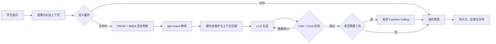

<div align="center">


# GMP Agent · 智药境

### 把 GMP 教材，变成一座可以探索、对话与推演的虚拟药厂

一个会检索法规、记住学习进度、调用工具并自我校验的 AI 原生教学平台。

**简体中文** · **[English](./README_EN.md)**

<p>
  
  
  
  
  
</p>

> **From regulation to simulation. From answering questions to building judgment.**

</div>

<p align="center">
  
</p>

<p align="center"><sub>审查版虚拟药厂总图 · 9 大功能分区 · 从人员入口到三废处理的完整生产空间</sub></p>

---

## 这不只是一个问答机器人

传统 GMP 学习往往停留在“记条文、背答案”。GMP Agent 试图再往前走一步：把法规、真实检查缺陷、课程任务、个人掌握度和虚拟生产场景连接起来，让学生在一次次提问、判断和行动中形成质量意识。

学生看到的是一个随时在线的学习伙伴；系统背后运行的是一条可检索、可追踪、可校验、可评估的 Agent 链路。

<table>
<tr>
<td width="50%" valign="top">

### 🤖 会查、会想、会纠错

Tutor Agent 使用 LangGraph 组织 `检索 → 生成 → 批判 → 修订 → 回答`。答案不只来自模型参数，还会经过法规检索、重排和事实一致性检查，并保留条款来源。

</td>
<td width="50%" valign="top">

### 🧠 真正连续的个性化学习

用户画像、递归摘要、工作记忆与经验召回共同组成分层记忆。系统既能接住当前对话，也能根据专业、学段和历史薄弱点调整解释方式。

</td>
</tr>
<tr>
<td valign="top">

### 🎮 把知识放进场景里

11 个课程项目与虚拟药厂场景相互映射。学习不再只有章节列表，还包括地图探索、案例推演、章节测验、Boss 战、排行榜和间隔复习。

</td>
<td valign="top">

### 🛡️ 为可靠性设置边界

工具参数校验、超时与退避重试、循环步数限制、重复调用检测、敏感操作人工确认和降级回答，共同约束 Agent 的不确定行为。

</td>
</tr>
</table>

---

## 一次提问，背后发生了什么


```mermaid
flowchart LR
    Q[学生提问] --> C[画像与对话上下文]
    C --> S{语义缓存}
    S -->|命中| A[组织答案]
    S -->|未命中| R[HNSW + BM25 混合检索]
    R --> RR[gte-rerank 精排]
    RR --> P[硬约束保护与上下文压缩]
    P --> G[LLM 生成]
    G --> V{Critic / CoVe 校验}
    V -->|需要修订| G
    V -->|通过| T{是否需要工具}
    T -->|是| F[受控 Function Calling]
    F --> A
    T -->|否| A
    A --> M[持久化、反馈与评测]
```

这条链路的重点不是“多调用几次大模型”，而是把每个不确定环节变成可以观察和约束的工程节点：检索是否召回、上下文是否丢失否定词、工具是否真的执行、修订是否改善答案，都可以单独测试。

---

## 走进虚拟药厂

总图之外，系统已经沉淀 9 张经过审查的独立分区图，可作为后续地图交互、任务落点和空间化教学的统一视觉底座。

<table>
<tr>
<td width="33%" align="center" valign="top">
  <br />
  <sub><b>检验区 QC</b><br />把取样、检验与数据完整性放进现场</sub>
</td>
<td width="33%" align="center" valign="top">
  <br />
  <sub><b>片剂车间</b><br />从物料流转到生产偏差的完整任务空间</sub>
</td>
<td width="33%" align="center" valign="top">
  <br />
  <sub><b>三废处理区</b><br />把合规边界延伸到生产系统之外</sub>
</td>
</tr>
</table>

---

## 为什么这样设计

| 设计选择 | 项目中的思考 |
|---|---|
| **中心化编排，而非自由协商的多 Agent** | 教学场景更看重过程可控、结果可解释和责任边界。由 Tutor Agent 统一维护状态与路由，专项能力通过工具和节点扩展，减少状态冲突与不可预测成本。 |
| **HNSW + BM25，而非只做向量检索** | GMP 问题既有语义表达，也包含条款号、术语和精确否定词。稠密检索负责“意思接近”，关键词检索负责“字面不能错”，再由重排器统一排序。 |
| **Small-to-Big 分块** | 小块提高召回精度，大块补足条文上下文；避免固定大 Chunk 把多个主题混在一起，也避免过小 Chunk 截断前提条件。 |
| **独立 Critic 与修订回路** | 生成模型“回答得像”不等于“依据正确”。Critic 检查法规引用、上下文一致性和明显幻觉，失败时触发有限次数的修订，而不是无限自循环。 |
| **分层记忆，而非无限拼接历史** | 短期窗口保证当前语义，递归摘要控制 Token，画像保存稳定偏好，经验召回只在相关问题出现时注入。上下文越长并不必然越好。 |
| **先做可重复评测，再做模型对比** | 系统已有固定黄金集、客观题集和专家论述题集。多 LLM 消融被明确放在 Roadmap 中，避免在评价基准不稳定时得出漂亮但无意义的结论。 |

---

## 项目规模，一眼看懂

| **知识底座** | **学习内容** | **质量验证** | **沉浸场景** |
|:---:|:---:|:---:|:---:|
| **469** 个知识点 | **543** 道课程题目 | **302** 项测试通过 | **9** 个审查分区 |
| **7,290** 条知识点—法规边 | **117** 个案例 | **35** 条 RAG 黄金集 | **11** 个课程项目 |
| **1,740** 条法规与附录内容 | **590** 个技能点 | **505 + 38** 条专项评测样本 | **1** 张一体化药厂总图 |

> 大规模课程与知识图谱数据通过 MySQL 管理，仓库不直接分发教学数据库 dump。

---

## Agent 的工程底座

```text
┌──────────────────────────────────────────────────────────┐
│  gmp-web · Next.js 16 · React 19 · TypeScript · ECharts │
│  学生端 / 教师端 / 管理端 / 游戏化仿真 / SSE 流式交互     │
└────────────────────────────┬─────────────────────────────┘
                             │ REST + SSE
┌────────────────────────────▼─────────────────────────────┐
│  gmp-api · FastAPI · LangGraph                          │
│                                                          │
│  Tutor Graph     retrieve → generate → critique → revise │
│  Retrieval       HNSW + MySQL FULLTEXT + rerank          │
│  Memory          profile + summary + working + experience│
│  Tool Runtime    6 tools + schema + retry + HITL + guard │
│  Evaluation      RAGAS + SelfCheckGPT + CoVe + baselines │
└────────────────────────────┬─────────────────────────────┘
                             │ pooled access
┌────────────────────────────▼─────────────────────────────┐
│  MySQL 8+ · 课程 / 法规 / 题库 / 学习轨迹 / Agent 状态     │
└──────────────────────────────────────────────────────────┘
```

| 层次 | 主要技术 |
|---|---|
| Web | Next.js 16.2、React 19、TypeScript、Tailwind CSS、Radix UI、ECharts |
| Agent API | FastAPI 0.115、LangGraph、Pydantic、SSE |
| LLM | 通义千问、`text-embedding-v3`、`gte-rerank` |
| Retrieval | `hnswlib`、MySQL FULLTEXT、混合融合、重排与约束保护 |
| Reliability | 连接池、共享检索执行器、超时重试、循环守卫、HITL、请求级耗时观测 |
| Evaluation | RAGAS、锚点召回指标、SelfCheckGPT、CoVe、并发基线 |

---

## 评测不是发布前的一次考试

- **RAG 黄金集：** 35 条固定问题，记录检索上下文、配置和运行元数据，避免评测结果无法复现。
- **专项题集：** 505 条客观题与 38 条专家论述题分离管理，既测确定性知识，也测开放回答质量。
- **链路级测试：** 覆盖分块、召回融合、重排、硬约束保留、Critic 修订、记忆、工具超时、重试、权限与循环保护。
- **性能基线：** 记录端到端耗时及 retrieve / generate / critique 等阶段耗时，并提供受控并发脚本。
- **下一阶段：** 在同一数据集、提示词、检索上下文和温度配置下开展多 LLM 消融，区分模型能力与系统工程收益。

---

<details>
<summary><b>🚀 本地启动</b></summary>

### 环境要求

- Node.js 20+
- Python 3.11+
- MySQL 8+

```bash
# 1. 克隆项目
git clone https://github.com/Cryptic-LEY/gmp-agent.git
cd gmp-agent

# 2. 初始化数据库
mysql -u root gmp < gmp-web/db/migrations-mysql/0000_init_mysql.sql

# 3. 启动 Web
cd gmp-web
npm install
cp .env.local.example .env.local
npm run dev

# 4. 启动 Agent API
cd ../gmp-api
pip install -r requirements.txt
cp .env.example .env
uvicorn main:app --reload --port 8001
```

Web 默认运行在 `http://localhost:3000`，Agent API 默认运行在 `http://localhost:8001`。完整配置见 [SETUP.md](./SETUP.md)。

</details>

<details>
<summary><b>🗂️ 项目结构</b></summary>

```text
gmp-agent/
├── gmp-web/              # Next.js Web、角色门户与虚拟仿真
│   ├── app/              # Dashboard、Course、Chat、Practice、Simulation
│   ├── db/               # Drizzle Schema 与 MySQL migrations
│   └── public/           # Logo、地图与场景素材
├── gmp-api/              # FastAPI + LangGraph Agent 服务
│   ├── agents/           # Tutor Graph、Tool Agent、Guard、HITL
│   ├── rag/              # Chunk、HNSW、BM25、Rerank、Compression
│   ├── memory/           # Profile、Summary、Working、Experience
│   ├── tools/            # 工具注册、参数校验与受控运行时
│   └── eval/             # 黄金集、专项题集、RAG 与性能评测
├── specs/                # 核心能力规格与验收标准
└── SETUP.md              # 完整启动说明
```

</details>

---

## Roadmap

- [x] 混合检索、重排、小到大分块与硬约束保护
- [x] 分层记忆、Agent 工具循环、超时重试与人工确认
- [x] 可复现 RAG / 客观题 / 专家论述题评测基线
- [x] 受控并发与阶段耗时观测
- [x] 9 大分区与一体化虚拟药厂视觉底座
- [ ] 多 LLM 消融与成本—质量—延迟联合对比
- [ ] Redis 分布式状态、限流、熔断与任务队列的生产化收口

---

<div align="center">

### 让法规不止被记住，更能在真实情境中被正确使用。

Built with **LangGraph · Qwen · Next.js · FastAPI**

[English](./README_EN.md) · [启动指南](./SETUP.md)

</div>
