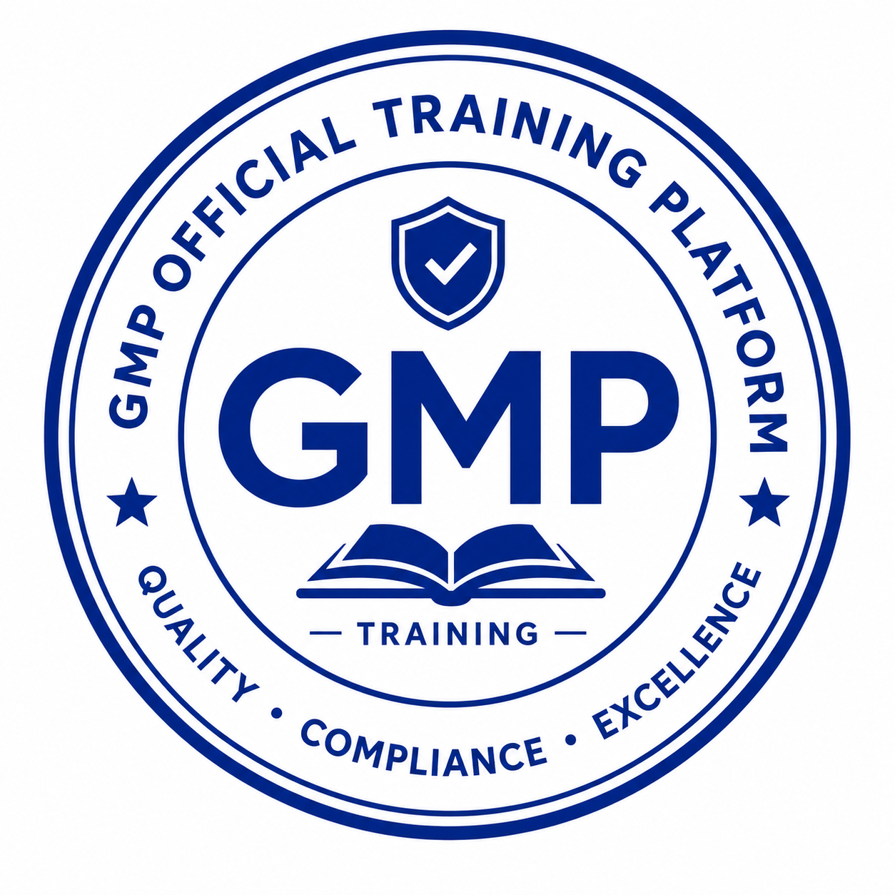
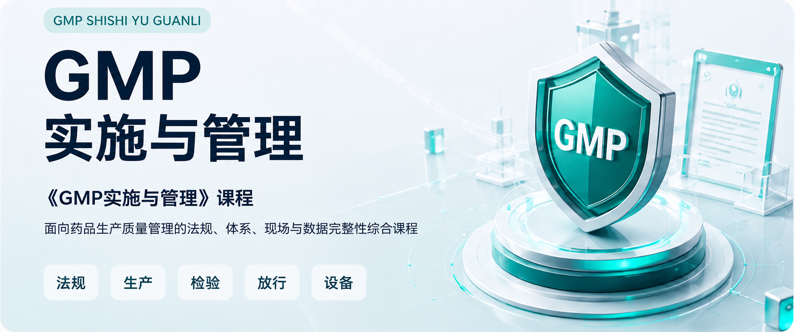
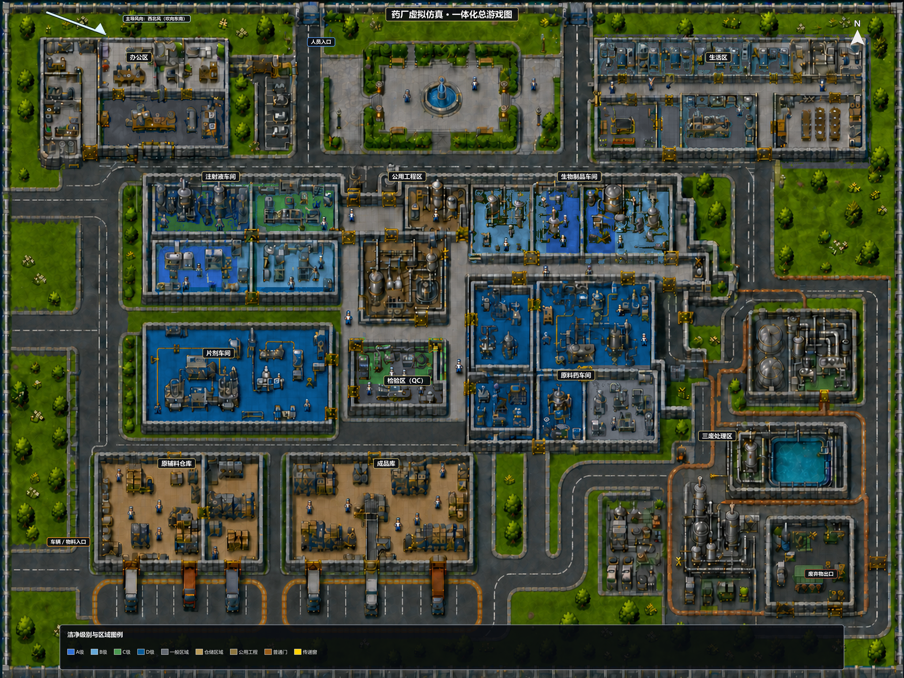
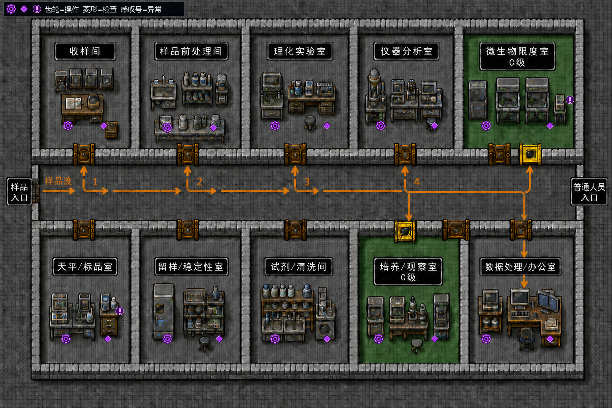
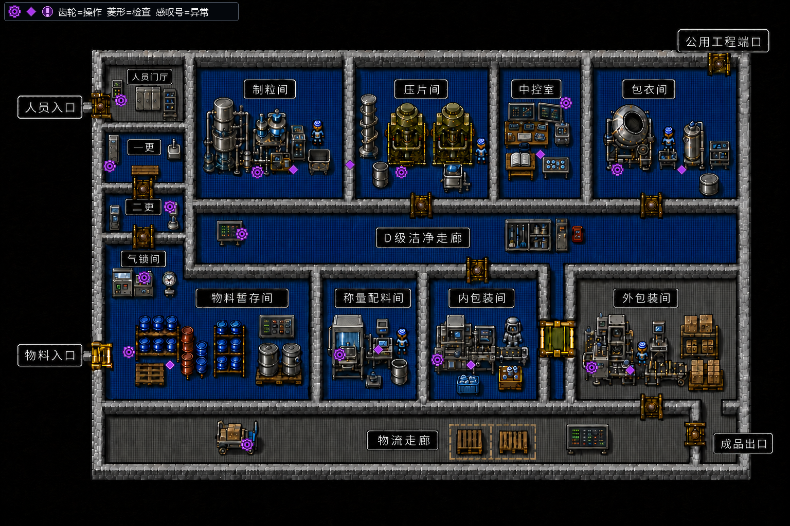
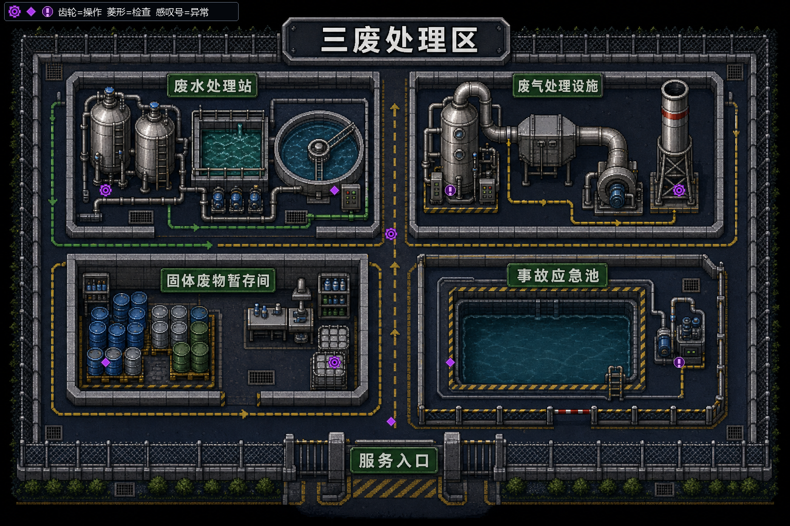

<div align="center">



# GMP Agent

### 面向药学与制药工程教育的 AI 原生 GMP 学习平台

让法规会说话，让知识进入现场，让每一次学习都能被引导、被验证、被沉淀。

**AI 智能助教** · **个性化学习** · **虚拟药厂** · **游戏化实训** · **多角色教学管理**

**简体中文** · **[English](./README_EN.md)**

</div>

<p align="center">
  
</p>

<div align="center">

### 从一条法规，到一次真实决策

GMP Agent 把课程、法规、案例、AI 辅导和虚拟仿真整合为一套连续的学习体验。

</div>

---

## 为 GMP 教学打造的数字学习空间

GMP 教学的难点从来不只是“内容多”，而是法规语言抽象、知识与生产现场割裂、学生差异难以兼顾，教师也很难持续掌握每个人真正的薄弱点。

GMP Agent 以真实检查缺陷和药品生产场景为入口，将 **AI Agent、课程体系、知识图谱、评测反馈与游戏化仿真**组合成完整产品，让学生从“记住条文”逐步走向“理解风险并作出正确判断”。

<table>
<tr>
<td width="33%" valign="top">

### 👨‍🎓 对学生

获得随时在线的 AI 助教、个性化学习路径、薄弱点追踪和沉浸式实训，不再独自面对大段法规。

</td>
<td width="33%" valign="top">

### 👩‍🏫 对教师

统一管理课程、题库、作业与班级表现，用学习数据发现共性问题，把时间留给真正需要教学判断的环节。

</td>
<td width="33%" valign="top">

### 🏫 对院校

形成可部署、可运营、可持续扩充的数字化课程载体，将专业知识、教学活动和实训资源沉淀为长期资产。

</td>
</tr>
</table>

---

## 一套产品，覆盖完整学习闭环

<table>
<tr>
<td width="50%" valign="top">

### 🤖 AI 智能助教

围绕 GMP 法规、生产质量和课程问题持续对话。回答附带法规依据，并根据学生学段、专业方向与历史薄弱点调整讲解深度。

</td>
<td width="50%" valign="top">

### 🧭 个性化学习路径

通过入学前测、用户画像、知识点掌握度和历史表现生成学习计划，让不同基础的学生拥有不同的学习起点和推进节奏。

</td>
</tr>
<tr>
<td valign="top">

### 📚 课程与智能练习

11 个课程项目串联知识点、法规、AI 课堂、章节测验、讨论区和作业。543 道题库支持分章节、分难度的持续训练。

</td>
<td valign="top">

### 🏭 虚拟药厂实训

把片剂、原料药、注射液、生物制品、QC、仓储和三废处理等区域放进一体化地图，让质量风险在空间和任务中变得可感知。

</td>
</tr>
<tr>
<td valign="top">

### 🎮 游戏化成长体系

等级成长、连续学习、项目解锁、排行榜、Boss 战与间隔复习共同构成正反馈，让严肃的合规训练保持参与感。

</td>
<td valign="top">

### 📊 教师与管理工作台

教师完成作业发布、课程管理、题库浏览和班级分析；管理员维护用户、知识关系和系统配置，形成完整运营闭环。

</td>
</tr>
</table>

---

## 从第一次登录，到形成岗位能力

<table>
<tr>
<td width="19%" align="center" valign="top">
  <b>01 · 建立学情</b><br /><br />
  完成身份选择与入学前测
</td>
<td width="2%" align="center">→</td>
<td width="19%" align="center" valign="top">
  <b>02 · 获得路径</b><br /><br />
  生成个人课程与薄弱点计划
</td>
<td width="2%" align="center">→</td>
<td width="19%" align="center" valign="top">
  <b>03 · 学练结合</b><br /><br />
  AI 辅导、课程、题库同步推进
</td>
<td width="2%" align="center">→</td>
<td width="19%" align="center" valign="top">
  <b>04 · 场景实训</b><br /><br />
  在虚拟药厂中识别风险并决策
</td>
<td width="2%" align="center">→</td>
<td width="19%" align="center" valign="top">
  <b>05 · 反馈成长</b><br /><br />
  沉淀掌握度、错题与学习经验
</td>
</tr>
</table>

---

## 一座可以继续生长的虚拟药厂

<p align="center">
  
</p>

<p align="center"><sub>审查版一体化总图 · 9 大功能分区 · 人流、物流、生产、检验与环保区域统一规划</sub></p>

这张地图不是单纯的视觉背景。每个区域都可以承载课程入口、风险事件、检查任务、角色互动和能力评价，为后续扩展更多剂型与实训项目提供统一空间底座。

<table>
<tr>
<td width="33%" align="center" valign="top">
  <br />
  <sub><b>检验区 QC</b><br />取样、检验与数据完整性</sub>
</td>
<td width="33%" align="center" valign="top">
  <br />
  <sub><b>片剂车间</b><br />物料流转、生产控制与偏差调查</sub>
</td>
<td width="33%" align="center" valign="top">
  <br />
  <sub><b>三废处理区</b><br />生产边界之外的合规责任</sub>
</td>
</tr>
</table>

---

## 产品内容与交付成果

| **知识体系** | **教学内容** | **产品质量** | **仿真空间** |
|:---:|:---:|:---:|:---:|
| **469** 个知识点 | **543** 道课程题目 | **302** 项测试通过 | **9** 个审查分区 |
| **7,290** 条知识点—法规关联 | **117** 个生产案例 | **35** 条 RAG 黄金集 | **11** 个课程项目 |
| **1,740** 条法规与附录内容 | **590** 个技能点 | **505 + 38** 条专项评测样本 | **1** 张一体化总图 |

这些数字分别对应知识建模、课程生产、系统验证与场景建设，而不是为了展示规模简单堆叠的数据量。

---

## 它不是一个套壳 Agent Demo

<table>
<tr>
<td width="25%" valign="top">

**完整产品形态**

学生端、教师端、管理员端和仿真实训共同工作，而不是只有一个聊天窗口。

</td>
<td width="25%" valign="top">

**专业知识底座**

回答建立在法规、知识点、案例和真实检查缺陷之上，并保留来源依据。

</td>
<td width="25%" valign="top">

**受控 Agent 行为**

工具调用、记忆、重试、循环限制和人工确认都有明确边界，避免无限自治。

</td>
<td width="25%" valign="top">

**持续质量闭环**

固定评测集、链路测试、阶段耗时和并发基线让每次优化都可以被比较。

</td>
</tr>
</table>

---

## 整体架构

```text
┌─────────────────────────────────────────────────────────────┐
│                         产品体验层                           │
│  学生学习中心 · 教师工作台 · 管理后台 · 虚拟药厂 · 数据看板  │
└──────────────────────────────┬──────────────────────────────┘
                               │ REST API / SSE
┌──────────────────────────────▼──────────────────────────────┐
│                      AI 交互与业务服务层                     │
│  AI 助教 · 个性化计划 · 课程与题库 · 学习反馈 · 角色权限      │
└──────────────────────────────┬──────────────────────────────┘
                               │
┌──────────────────────────────▼──────────────────────────────┐
│                         Agent 能力层                         │
│  LangGraph 编排 · 混合检索 RAG · 分层记忆 · 工具调用 · 自检  │
└──────────────────────────────┬──────────────────────────────┘
                               │
┌──────────────────────────────▼──────────────────────────────┐
│                         数据与评测层                         │
│  MySQL · 法规库 · 知识图谱 · 学习轨迹 · 黄金集 · 性能基线     │
└─────────────────────────────────────────────────────────────┘
```

整体采用中心化 Agent 编排：Tutor Agent 维护对话和任务状态，RAG、记忆和工具作为受控能力接入。这样既保留 Agent 对开放问题的适应性，也能满足教学产品对稳定性、可解释性和权限边界的要求。

| 工程关注点 | 当前实现 |
|---|---|
| **可信回答** | HNSW + MySQL FULLTEXT 混合检索、`gte-rerank` 精排、法规来源标注 |
| **上下文管理** | 用户画像、递归摘要、工作记忆、经验召回，避免无限拼接历史 |
| **行为安全** | 参数校验、超时重试、循环守卫、重复调用检测、HITL 人工确认 |
| **性能意识** | 数据库连接池、共享检索执行器、请求级阶段耗时、受控并发基线 |
| **可验证迭代** | 302 项测试、固定黄金集、客观题与专家论述题专项评测 |

---

<details>
<summary><b>🚀 展开查看本地启动</b></summary>

### 环境要求

- Node.js 20+
- Python 3.11+
- MySQL 8+

```bash
git clone https://github.com/Cryptic-LEY/gmp-agent.git
cd gmp-agent

# 初始化数据库
mysql -u root gmp < gmp-web/db/migrations-mysql/0000_init_mysql.sql

# 启动 Web
cd gmp-web
npm install
cp .env.local.example .env.local
npm run dev

# 启动 Agent API
cd ../gmp-api
pip install -r requirements.txt
cp .env.example .env
uvicorn main:app --reload --port 8001
```

Web 默认运行在 `http://localhost:3000`，Agent API 默认运行在 `http://localhost:8001`。完整配置见 [SETUP.md](./SETUP.md)。

</details>

---

## 下一阶段

- [x] AI 助教、课程、题库、教师与管理门户形成产品闭环
- [x] 混合检索、分层记忆、工具调用、自检修订与评测基线
- [x] 9 大审查分区与一体化虚拟药厂视觉底座
- [ ] 多 LLM 消融与质量—延迟—成本联合对比
- [ ] Redis 分布式状态、限流、熔断与任务队列的生产化收口

---

<div align="center">

### 让 GMP 不止被记住，更能在真实情境中被正确使用。

**LangGraph · Qwen · Next.js · FastAPI · MySQL**

[English](./README_EN.md) · [启动指南](./SETUP.md)

</div>
