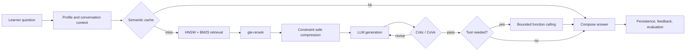

<div align="center">


# GMP Agent · A Living GMP Learning World

### Turning regulation-heavy coursework into an explorable, conversational virtual pharmaceutical plant

An AI-native learning platform that retrieves regulations, remembers progress, calls tools, and verifies its own answers.

**[简体中文](./README.md)** · **English**

<p>
  
  
  
  
  
</p>

> **From regulation to simulation. From answering questions to building judgment.**

</div>

<p align="center">
  
</p>

<p align="center"><sub>Reviewed virtual plant master map · nine functional zones · one connected learning world</sub></p>

---

## More than a chatbot

GMP education is usually dominated by clauses, definitions, and model answers. GMP Agent connects regulations, real inspection findings, course tasks, personal mastery, and production scenarios so that students can build quality judgment through questions, decisions, and simulated actions.

The learner sees an always-available study partner. Underneath is an observable and testable Agent pipeline with retrieval, critique, tool execution, memory, and evaluation.

<table>
<tr>
<td width="50%" valign="top">

### 🤖 Retrieve, reason, correct

A LangGraph Tutor Agent coordinates `retrieve → generate → critique → revise → respond`. Hybrid retrieval, reranking, grounded citations, and a bounded revision loop reduce confident but unsupported answers.

</td>
<td width="50%" valign="top">

### 🧠 Learning that continues

User profiles, recursive summaries, working memory, and experience recall keep conversations coherent without blindly appending the entire chat history.

</td>
</tr>
<tr>
<td valign="top">

### 🎮 Knowledge inside a world

Eleven course projects connect learning objectives to plant scenarios, quizzes, case simulations, progression, leaderboards, and spaced review.

</td>
<td valign="top">

### 🛡️ Bounded autonomy

Schema validation, timeouts, backoff retries, step budgets, repeated-call detection, HITL approval, and graceful degradation constrain uncertain Agent behavior.

</td>
</tr>
</table>

---

## What happens after a learner asks a question?



The point is not to call an LLM more often. It is to turn uncertain steps into observable engineering boundaries: retrieval can be measured, constraints can be tested, tool execution can be verified, and revisions can be compared.

---

## Inside the virtual plant

Nine reviewed zone maps provide a consistent visual foundation for spatial learning, interactive missions, and future simulation expansion.

<table>
<tr>
<td width="33%" align="center" valign="top">
  <br />
  <sub><b>Quality Control</b><br />Sampling, testing, and data integrity in context</sub>
</td>
<td width="33%" align="center" valign="top">
  <br />
  <sub><b>Tablet Workshop</b><br />Material flow, process control, and deviation tasks</sub>
</td>
<td width="33%" align="center" valign="top">
  <br />
  <sub><b>Waste Treatment</b><br />Compliance beyond the production line</sub>
</td>
</tr>
</table>

---

## Product and engineering decisions

| Decision | Rationale |
|---|---|
| **Central orchestration** | Education needs traceable state, predictable control, and clear responsibility. A Tutor Agent owns the workflow while tools and graph nodes provide specialist capabilities. |
| **Hybrid retrieval** | GMP questions mix semantic intent with exact clause numbers, terminology, and negations. HNSW finds meaning; full-text retrieval protects lexical precision; reranking reconciles both. |
| **Small-to-Big chunking** | Small chunks improve recall precision while parent chunks restore the conditions surrounding a clause. |
| **A separate Critic loop** | Fluent answers are not necessarily grounded answers. The Critic checks citations and context consistency, then triggers only a bounded number of revisions. |
| **Layered memory** | Recent turns preserve immediate meaning, summaries control tokens, profiles retain stable traits, and experiences are injected only when relevant. |
| **Evaluation before ablation** | Stable golden sets and task-specific banks come before multi-model comparisons, so model gains are not confused with retrieval or prompt changes. |

---

## At a glance

| **Knowledge foundation** | **Learning content** | **Quality signals** | **Simulation** |
|:---:|:---:|:---:|:---:|
| **469** knowledge points | **543** course questions | **302** tests passed | **9** reviewed zones |
| **7,290** regulation links | **117** cases | **35** RAG golden items | **11** course projects |
| **1,740** regulation records | **590** skill points | **505 + 38** evaluation items | **1** integrated master map |

> Large course and knowledge-graph datasets are managed in MySQL and are not distributed as a database dump in this repository.

---

## Engineering foundation

| Layer | Technologies and design |
|---|---|
| Web | Next.js 16.2, React 19, TypeScript, Tailwind CSS, Radix UI, ECharts |
| Agent API | FastAPI 0.115, LangGraph, Pydantic, SSE |
| LLM | Qwen, `text-embedding-v3`, `gte-rerank` |
| Retrieval | `hnswlib`, MySQL FULLTEXT, hybrid fusion, reranking, constraint-safe compression |
| Reliability | Connection pooling, shared retrieval workers, timeout retries, loop guards, HITL, request-stage timings |
| Evaluation | RAGAS, anchored recall metrics, SelfCheckGPT, CoVe, controlled concurrency baselines |

---

## Evaluation as a continuous loop

- **35-item RAG golden set** with retrieval context, configuration, and run metadata.
- **505 objective questions + 38 expert essay questions** kept as separate evaluation banks.
- **Pipeline-level tests** for chunking, retrieval fusion, reranking, constraint retention, revision, memory, tools, retries, permissions, and loop safety.
- **Latency and concurrency baselines** with end-to-end and per-stage timing.
- **Next:** multi-LLM ablation under the same dataset, prompts, retrieved context, and sampling configuration.

---

<details>
<summary><b>🚀 Quick start</b></summary>

### Requirements

- Node.js 20+
- Python 3.11+
- MySQL 8+

```bash
git clone https://github.com/Cryptic-LEY/gmp-agent.git
cd gmp-agent

# Database
mysql -u root gmp < gmp-web/db/migrations-mysql/0000_init_mysql.sql

# Web
cd gmp-web
npm install
cp .env.local.example .env.local
npm run dev

# Agent API
cd ../gmp-api
pip install -r requirements.txt
cp .env.example .env
uvicorn main:app --reload --port 8001
```

The Web app defaults to `http://localhost:3000`; the Agent API defaults to `http://localhost:8001`. See [SETUP.md](./SETUP.md) for full configuration.

</details>

<details>
<summary><b>🗂️ Repository map</b></summary>

```text
gmp-agent/
├── gmp-web/              # Next.js portals and virtual simulation
│   ├── app/              # Dashboard, Course, Chat, Practice, Simulation
│   ├── db/               # Drizzle schema and MySQL migrations
│   └── public/           # Brand, map, and scene assets
├── gmp-api/              # FastAPI + LangGraph Agent service
│   ├── agents/           # Tutor graph, Tool Agent, guards, HITL
│   ├── rag/              # Chunking, HNSW, BM25, reranking, compression
│   ├── memory/           # Profile, summary, working, experience memory
│   ├── tools/            # Registry, validation, and bounded runtime
│   └── eval/             # Golden sets and RAG/performance evaluation
├── specs/                # Capability specifications and acceptance criteria
└── SETUP.md              # Complete setup guide
```

</details>

---

## Roadmap

- [x] Hybrid retrieval, reranking, Small-to-Big chunking, constraint protection
- [x] Layered memory, tool loop, timeout retries, HITL approval
- [x] Reproducible RAG, objective-question, and expert-essay baselines
- [x] Controlled concurrency and request-stage observability
- [x] Nine reviewed zones and an integrated virtual plant map
- [ ] Multi-LLM ablation across quality, latency, and cost
- [ ] Production hardening for distributed state, rate limiting, circuit breaking, and queues

---

<div align="center">

### Regulations should not only be remembered. They should be applied correctly under pressure.

Built with **LangGraph · Qwen · Next.js · FastAPI**

[简体中文](./README.md) · [Setup](./SETUP.md)

</div>
